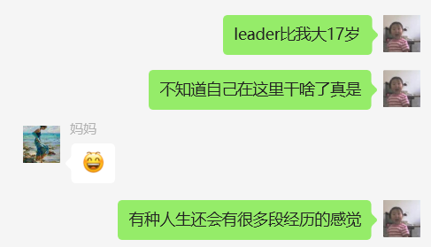

对面同为实习生的小姐姐腼腆说她这周回家，听到自己笑着对她说那就拜个早年吧。
今年孩子气的说自己要过公历生日，翻到日历一看已经是小年。
马上就二十岁了，工位环境中不知是空调还是隔壁装修微微的轰鸣短短实习十几天就已经习惯到忽略，这个半夜在出租屋门口迷路疑似原因是世界反转，加班加到需要没带手套骑共享单车狂奔去另一个地铁站口，辗转与北京加班和威海考试周的 苦寒又漫长的冬日，已经快要过去了。
其实你也经常把自己逼到这种境地，但正值20岁的节点，就会在简单的年龄划分中读取另一种意味。
虽然有些些早熟，虽然喜欢找哥哥姐姐玩，但你其实远远不用长的那么快。

四舍五入，比妹妹大十岁的我 所思所想 所作所为已经是两个世界的人，那再过十年，你仍旧会有翻天覆地的变化啊。

# 和十几岁相比会有什么变化呢
毕竟十九岁听上去还可以是个青少年，二十岁就切切实实要当个年轻人了。

十几岁和是自己和过去的斗争，二十岁就会是自己和世界的相处了

大家真的会慢慢进化掉尴尬这种感情，也只是因为会慢慢摆脱一些本就没有意义的社会规训，感情啊，野心啊，想法啊，本来就都不是什么值得尴尬的事情

# 写给自己女孩子的那一部分

工科实验楼，stem公司深夜总是关着灯的女卫。
二十岁的你暂时还没有家庭，感情和适龄的压迫，你要做的就是努力，努力学习，努力工作，努力生活，努力成为你自己。
但这样的大环境下，我无法保证你会有什么结果。
就像之前开玩笑说的生孩子之前一定要有一笔自己的存款，不是存给孩子就单是给自己，你一定要永远拥有选择的自由，即使是你自己选择了归途。

为自己的女性视角感到自豪，并争取传递出去。

# 提醒自己

记得浪漫

记得健康

别被焦虑渗透

记得读书

当知足在苦难之上

先向身边学习，学习聊天学习气质，倾听，搞钱

但也别忘记自己，你时时刻刻提醒自己要谦卑，但很多时候根本意识不到自己的重要与

提醒自己不论多么干涸与贫瘠都要记得写点东西，记得联系朋友们，这亦有可能是你接下来的岁月中“当时只道是寻常”的美好。

很多东西无法两全，但生活此刻开始，很多事情拿在人生的维度去看，绝对会为此刻的自己鼓掌啊
>再也没有吃到像那夜的好豆，再也没有看到像那夜的好戏了

关于亲密关系

请关注最近的身边与自身，还有最远的星空与热爱。
有些事情确实是不关注就不存在的

其实也别急着写总结

你对人会关注什么呢
